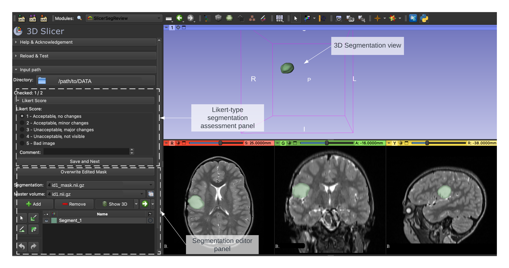
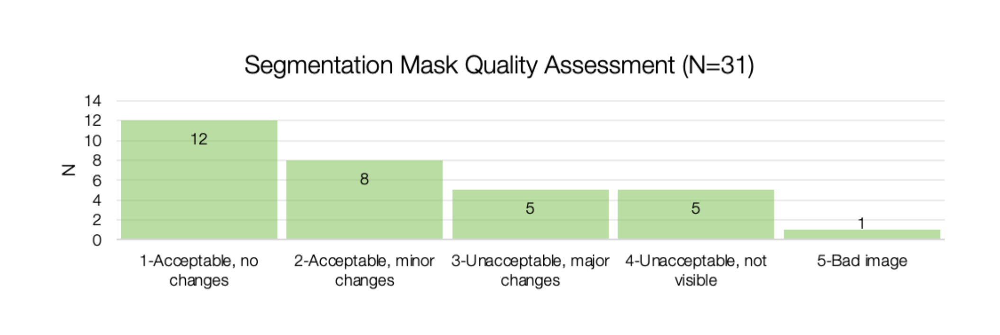
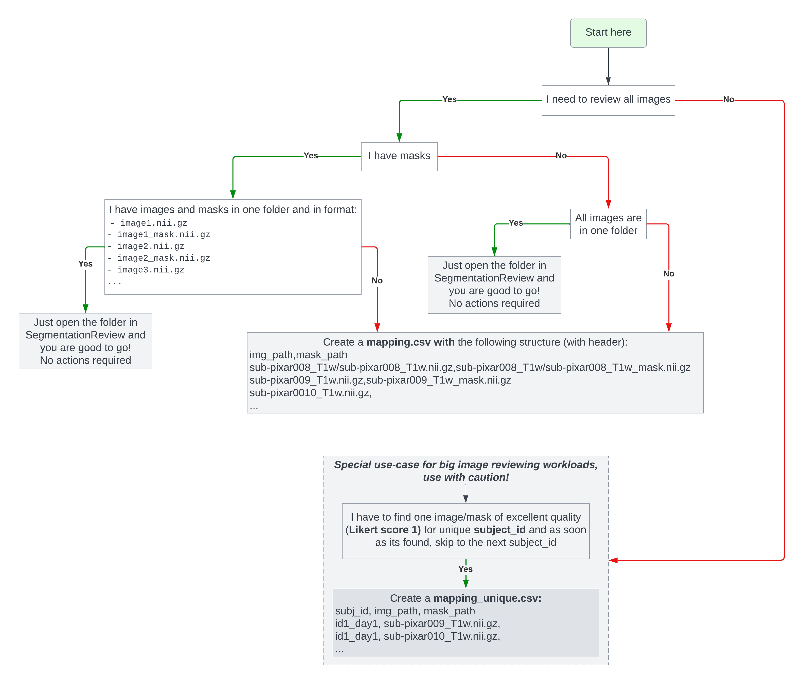

# SegmentationReview

The SegmentationReview extension is a powerful tool for clinicians who need to quickly and efficiently review deep-learning generated segmentations. With this extension, you can use a Likert-type rating system that scores segmentations on a four-point scale, ranging from "Acceptable with no changes" to "Unacceptable, not visible/wrong location".

One of the key benefits of SegmentationReview is the ability to load the entire dataset with all masks and volumes in one batch. This simplifies the workflow and eliminates the need to load masks and volumes separately. Additionally, the results of the review are saved as a csv file, which can be easily used for further analysis.

NOTE: If you have not finished the review of all the masks in one go, feel free to close and resume the extension later on. The last annotated file would be restored from the annotations.csv file saved in the path. (That being said, this won't work if you annotated cases and then added new ones to the same folder. Keep new cases in the separate folder once you already started annotations to avoid conflicts)

Overall, SegmentationReview provides a streamlined solution for clinicians who want to speed up the validation process of deep-learning generated segmentations. It is a valuable tool that can help to improve workflow efficiency and reduce the burden associated with segmentation validation.

Note: available for 3D Slicer 5.3.0 marketplace and later. Updated version with no mask support, mapper.csv and centering of masks is available in 3D Slicer 5.5.0 (currently preview version) and later.

## Citation
If you found it useful in your work please cite the paper:
Anna Zapaishchykova, Divyanshu Tak, Aidan Boyd, Zezhong Ye, Hugo J.W.L. Aerts, Benjamin H. Kann
"SegmentationReview: A Slicer3D extension for fast review of AI-generated segmentations"
[https://doi.org/10.1016/j.simpa.2023.100536](https://doi.org/10.1016/j.simpa.2023.100536)


## Installing the extension (stable version)

You can install `SegmentationReview` from the 3D Slicer [extensions manager](https://slicer.readthedocs.io/en/latest/user_guide/extensions_manager.html) from version 5.3.0.

To open the extension manager, go to `View -> Extensions Manager` in the main menu. In the extensions manager, search for `SegmentationReview` and click  `Install` to install the extension. Once the extension is installed, switch to the `SegmentationReview` module by clicking `Modules -> SegmentationReview` in the main menu.

## Overview

<p align="center">
  
</p>

**Panel Overview:**

The interface displays three main panels:
- **Likert-type segmentation assessment**: Ratings are provided on a scale of 1 to 4, representing levels of (1) Acceptable with no changes, (2) Acceptable with minor changes, (3) Unacceptable with major changes, and (4) Unacceptable and not visible. A 5th option for bad images is also available.
- **Segmentation Editor**: The editor panel allows for fine-tuning of the segmentation.
- **2D/3D Segmentation View**: The 2D/3D view allows for visualization and comparison of the original image and the segmentation.

**Results:**

AI-generated segmentation ratings are automatically saved as a .csv file, which can be further analyzed using any tool of choice. The example above presents a dummy dataset using MS Office, but any other analysis tool can be used. 

<p align="center">
  
</p>

The `annotation.csv` has a following structure (with no header):

| Filename | Rating | Comments | Mask_filename | Mask_status |
| ---         |     ---      |          --- |          --- |          --- |
| image1.nii.gz   | Acceptable with no changes    |     | image1_mask.nii.gz  | Mask loaded |
| image2.nii.gz     | Bad images       | wrong sequence     | No mask| 
| ...    | ...      | ...    | 

- "Rating" (2nd column) has the following encoding: (1) Acceptable with no changes, (2) Acceptable with minor changes, (3) Unacceptable with major changes, (4) Unacceptable and not visible, and (5) Bad images.

- "Mask_status" (5th column) has the following encoding: (2) Mask loaded, (1) Cannot load mask  and (0) No mask

## Tutorial
<p align="center">
  
</p>

### OPTION 1: NO mapping file, the easiest option

1. **Prepare the dataset:Structure the input data folder (only works for nifti)**

To get started, create a folder with the following file structure:

```
- image1.nii.gz
- image1_mask.nii.gz
- image2.nii.gz
- image2_mask.nii.gz
- image3.nii.gz
...
```

The images should be in NIfTI format (`.nii.gz`), with corresponding segmentation masks labeled `_mask.nii.gz`. If masks are not available, you can still use the extension (images would be loaded for review without the mask), but you will not be able to edit the masks.

An example dataset of T1w brain scans and their corresponding brain segmentations is provided in the `example_dataset_no_mapping` folder with already reviewed images. You can use this dataset to test the extension. 
    

2. **Load the dataset into 3D Slicer:** After starting 3D Slicer, open `File -> Add Data` from the main menu, then select the folder containing the images and masks and press `OK`. After loading, you will see how many images are loaded under the _Checked_ status. If the path is opened for the first time, an `annotations.csv` file will be created in the same folder. This file will contain the results of the rating and will be automatically updated after each rating. Additionally, the `annotations.csv` file allows you to **restore** the annotation process in case of a crash or if there are too many images to rate in one session.

3. **Assign a Likert score to each image:** In the "SegmentationReview" module, click on the `Likert rating` tab, select the image, and then select a rating from the drop-down menu (ranging from _Acceptable with no changes_ to _Unacceptable and not visible_). When you're done, click `Save and Next` to move to the next image. The results will be automatically saved in the `annotations.csv` file.

4. **Optional: Edit the mask of an image:** If you want to change the segmentation mask of any image, you can use the "Segment Editor" module that is added to the extension. Select the `Segment editor` tab, edit the mask using the brushes or eraser, and then click `Overwrite edited mask` to save the new mask. The new mask will be saved in the same folder as the original mask, with timestamp added to the end of the name of mask.

### OPTION 2: with *mapping.csv* 

This is a more flexible option that allows to map the filenames in the folder to the filenames in the mapping file. This is useful when the filenames in the folder are not the same as in the mapping file. 

Create a *mapping.csv* with the following structure (with header):
```
img_path,mask_path
sub-pixar008_T1w/sub-pixar008_T1w.nii.gz,sub-pixar008_T1w/sub-pixar008_T1w_mask.nii.gz
sub-pixar009_T1w.nii.gz,sub-pixar009_T1w_mask.nii.gz
sub-pixar0010_T1w.nii.gz,
...
```

See an example in the `example_dataset_with_mapping` folder. Note: this would also work if the mask_path column is empty. In this case, the masks would not be loaded, but the images would still be loaded for review. Then, follow the steps 2-4 from the previous section "OPTION 1: NO mapping file".


### OPTION 3: with *mapping_unique.csv* 

 This is useful when you have multiple masks per subject and you want to find the "first" best one(Likert score 1).
Create a *mapping_unique.csv*:
```
subj_id, img_path, mask_path  
id1_day1, sub-pixar009_T1w.nii.gz,
id1_day1, sub-pixar010_T1w.nii.gz,
...
```
See an example in the `example_dataset_with_mapping_unique` folder.

## Installation

This extension is available from the extensions marketplace starting v.5.3.0. Here are the steps to install the extension from the source and develop the extension locally. This is useful for testing and contributing changes leveraging the GitHub pull request contribution workflow.

1. Download the source code using `git` / OR download the .zip and unpack it

  ```
  git clone git@github.com:zapaishchykova/SegmentationReview.git
  ```

(Optional) Enable the [developer mode](https://slicer.readthedocs.io/en/latest/user_guide/settings.html#developer-mode) will allow to reload the module from source without having to restart the application.

3. After starting 3D Slicer:
-  [install the module by drag&drop](https://discourse.slicer.org/t/new-feature-install-modules-by-drag-and-drop-python-files/28311) the extension source directory (works only in Preview Release)
OR
-  Navigate to "Developer tools"-> "Extension wizard" -> "Select extension" and point to the root of the cloned repo. 

The extension will pop up under the Modules:"Examples" section.

## Example Dataset

The example data was obtained from the [OpenfMRI databaset](https://openfmri.org/dataset/ds000228/). Its accession number is ds000228. Brains were segmented using [HD Brain Extraction tool](https://github.com/lassoan/SlicerHDBrainExtraction#hdbrainextraction). 


## To-Do
- [ ] Add support for DICOM
- [X] Add logging.txt file to keep track of the changes
- [ ] Add support for multiple masks per image (currently only one mask per image is supported, although you can have a workaround by merging masks into one file OR using mapping.csv file with multiple masks per image)
- [ ] Add support for multiple raters (currently only one rater is supported)
- [ ] Add notification that all images are rated/ask if you want to continue
- [X] Remove writing of extra file t.seg.nrrd when 3D segmentation is edited
- [X] Add option for fast review to search for "first best" match - mapping_unique.csv
- [X] Added key shortcuts for speed rating
- [X] Fixed bug with cleaning fiducials
- [X] Add posibility to create new mask if no mask is loaded

## Updates
Version available in 3D Slicer 5.3.0-5.5.0 marketplace does not include "no masks" support. Updated version with no mask support, mapper.csv and centering of masks is available currently in the preview release of 3D Slicer 5.5.0.
- 2023-10-10: Added the option to load the dataset with mapping.csv file. This is useful when the filenames in the folder are not the same as in the mapping file.
- 2023-10-10: Added the option to load the dataset without masks. This is useful when the masks are not available or if you need to check images only.
- 2023-10-10: Added the option to automatically center the image on the mask. This is useful when the masks are super small and you want to see them in the center of the image. Note: it works only if the mask is loaded.
- 2023-11-16: Bugfix: cleaning up fiducials. Added keyborad shortcuts: 1-shift+Q, 2-shift+W, 3-shift+E, 4-shift+R, 5-shift+T, Save rating&Next-cmd+enter. Added option for fast review to search for "first best" match using mapping_unique.csv. Added desicion tree diagram image for lost souls who don't know how to use the extension. Add posibility to create new mask if no mask is loaded. Now also saving the last edited mask path into the csv file (all these would be available in 3D Slicer 5.5.0 preview build after 2023-11-17 and later). 

## Known issues
- If your path is too long, the resizing might not work. To fix this, just collapse the the "Input path" panel and then you would be able to resize the window. 

## Acknowledgements
We would like to thank these authors for their significant contributions to the project:
- Vasco Prudente @vprudente
- Ibrahim Hadzic  @ibro45

## License
This extension is distributed under the terms of the MIT license.

